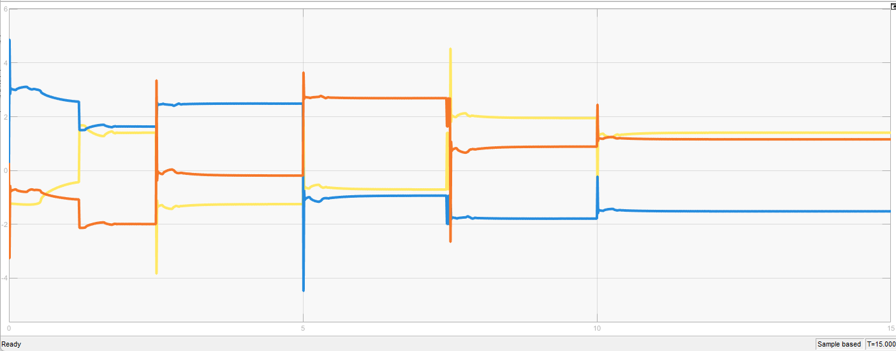

# Pose Control of Three\-Wheeled Omnidirectional Mobile Robot using Proportional Derivative \- Super Twisting Sliding Model Control

This strategy employs a cascade control approach. The cascade control structure consists of an outer loop using a Proportional\-Derivative (PD) controller to regulate the robot's velocity, ensuring it moves toward the desired position. Meanwhile, the inner loop utilizes the Super Twisting Sliding Mode Control (STSMC) method as a velocity controller, generating actuator voltage signals for each motor.

The design philosophy behind this controller is to leverage STSMC to handle the system's nonlinearities, external disturbances, and model uncertainties. Once a well\-performing velocity control is achieved, implementing a PD controller for position control becomes straightforward.

# Kinematics Model

schematic

Velocity transformation matrix

 $$ \dot{\xi} ={\left[\begin{array}{ccc} \cos {\left(\theta \right)} & -\sin {\left(\theta \right)} & 0\newline \sin {\left(\theta \right)} & \cos {\left(\theta \right)} & 0\newline 0 & 0 & 1 \end{array}\right]}{\dot{\xi} }_r $$ 

where

 $$ \xi ={\left[\begin{array}{ccc} x_r  & y_r  & \theta  \end{array}\right]} $$ 

-  $\xi$ is robot pose in inertial frame of reference 
-  $\xi_r$ is the robot pose in non\-inertial frame of reference (moving with the robot frame of reference) 
# State Space Model
 $$ \dot{X} =AX+BU+Ksign{\left(X\right)} $$ 

 $$ Y=CX $$ 

where

 $U={{\left[\begin{array}{ccc} u_1 {\left(t\right)} & u_2 {\left(t\right)} & u_3 {\left(t\right)} \end{array}\right]}}^T$ and $Y=X={{\left[\begin{array}{ccc} v\left(t\right) & v_n \left(t\right) & \omega {\left(t\right)} \end{array}\right]}}^T$ 

 $$ A={\left[\begin{array}{ccc} -\frac{3l^2 K_t^2 }{2MR_a r^2 }-\frac{B_v }{M} & 0 & 0\newline 0 & -\frac{3l^2 K_t^2 }{2MR_a r^2 }-\frac{B_{vn} }{M} & 0\newline 0 & 0 & -\frac{3b^2 l^2 K_t^2 }{I_n R_a r^2 }-\frac{B_w }{I_n } \end{array}\right]} $$ 

 $B=\frac{lK_t }{R_a r}{\left[\begin{array}{ccc} 0 & \frac{\cos {\left(\delta \right)}}{M} & -\frac{\cos {\left(\delta \right)}}{M}\newline -\frac{1}{M} & \frac{\sin {\left(\delta \right)}}{M} & \frac{\sin {\left(\delta \right)}}{M}\newline \frac{b}{I_n } & \frac{b}{I_n } & \frac{b}{I_n } \end{array}\right]}$ ;  $C=I$ 

 $$ K={\left[\begin{array}{ccc} -C_v  & 0 & 0\newline 0 & -\frac{C_{vn} }{M} & 0\newline 0 & 0 & -\frac{C_w }{I_n } \end{array}\right]} $$ 

In this simulation we are going to use this for the parameters values

# Control Strategy: Cascade Proportional Derivative \- Super Twisting Sliding Model Control (STSMC)

**Velocity Control (Inner Loop) using STSMC**

define the sliding surface as follow

 $$ s={\left[\begin{array}{c} s_1 \newline s_2 \newline s_3  \end{array}\right]}=e{\left(t\right)}+\lambda \int e{\left(t\right)}dt $$ 

 $$ \dot{s} =\dot{e} {\left(t\right)}+\lambda e{\left(t\right)} $$ 

where

 $$ e{\left(t\right)}=x-x_r $$ 

 $x={\left[\begin{array}{ccc} v & v_n  & \omega  \end{array}\right]}$ and $x_r$ is the velocity reference signal

Define the reaching law using super twisting algorithm

 $$ \dot{s} =\phi_1 {\left(\mathrm{s}\right)}+\upsilon $$ 

$$
\phi_1 (s) =
\begin{bmatrix} 
    -k_{11} \sqrt{\left| s_1 \right|} \operatorname{sign}(s_1) \\ 
    -k_{12} \sqrt{\left| s_2 \right|} \operatorname{sign}(s_2) \\ 
    -k_{13} \sqrt{\left| s_3 \right|} \operatorname{sign}(s_3) 
\end{bmatrix}
$$

 $$ \dot{\upsilon} ={\dot{\phi} }_2 {\left(s\right)}={\left[\begin{array}{c} -k_{21} sign{\left(s_1 \right)}\newline -k_{22} sign{\left(s_2 \right)}\newline -k_{23} sign{\left(s_3 \right)} \end{array}\right]} $$ 

take a look at the robot dynamic

 $$ \dot{x} =Ax+Bu+Ksign{\left(x\right)} $$ 

with the above formulations, we can choose $u\left(t\right)$ as the following:

 $$ \dot{s} =\dot{e} {\left(t\right)}+\lambda e{\left(t\right)} $$ 

 $$ \dot{s} ={\left(\dot{x} -{\dot{x} }_d \right)}+\lambda {\left(x-x_d \right)} $$ 

 $$ \dot{s} ={\left(Ax+Bu+Ksign{\left(x\right)}-{\dot{x} }_d \right)}+\lambda {\left(x-x_d \right)} $$ 

then

 $$ u{\left(t\right)}=\ -B^{-1} {\left({\left(A+\lambda \right)}x+Ksign{\left(x\right)}-{\dot{x} }_d -\lambda x_d +\phi_1 {\left(s\right)}+\phi_2 {\left(s\right)}\right)} $$ 

and

$$
\mathbf{u}(t) =
\begin{cases} 
    V_{\max}, & \text{jika } u(t) > V_{\max} \\ 
    u(t), & \text{jika } V_{\min} \leq u(t) \leq V_{\max} \\ 
    V_{\min}, & \text{jika } u(t) < V_{\min} 
\end{cases}
$$

that's conclude the inner loop which is just a velocity control of the mobile robot. After that, we design the outer loop to control the pose of the mobile robot using simple PD controller. We define error of pose

 $$ e_{inersia} =\xi_{ref} -\xi $$ 

 $$ \xi ={\left[\begin{array}{ccc} x_r  & y_r  & \theta  \end{array}\right]} $$ 

change frame of reference

 $$ e_{robot} ={{\left[\begin{array}{ccc} \cos {\left(\theta \right)} & -\sin {\left(\theta \right)} & 0\newline \sin {\left(\theta \right)} & \cos {\left(\theta \right)} & 0\newline 0 & 0 & 1 \end{array}\right]}}^T e_{inersia} $$ 

then by that, we design the control input for velocity setpoint $x\left(t\right)$ as the following

 $$ x{\left(t\right)}=K_p \ e_{robot} +K_d \ \frac{{de}_{robot} }{dt} $$ 

$$
\mathbf{x}(t) =
\begin{cases} 
    x_{\max}, & \text{jika } x(t) > x_{\max} \\ 
    x(t), & \text{jika } x_{\min} \leq x(t) \leq x_{\max} \\ 
    x_{\min}, & \text{jika } x(t) < x_{\min} 
\end{cases}
$$

with $x={\left[\begin{array}{ccc} v & v_n  & \omega  \end{array}\right]}$ 

# Result

The x\-y position graph of the robot (in meters). The graph below shows the robot's position compared to the given setpoint.

-  The purple line is the setpoint 
-  The yellow line is the robot x and y position 

The robot's initial position was intentionally given an offset of \-0.1 on the y\-axis, and the setpoint was designed to form a square trajectory with counterclockwise movement.

Control input signal (Voltage on each motor)

# Simulink Simulation

